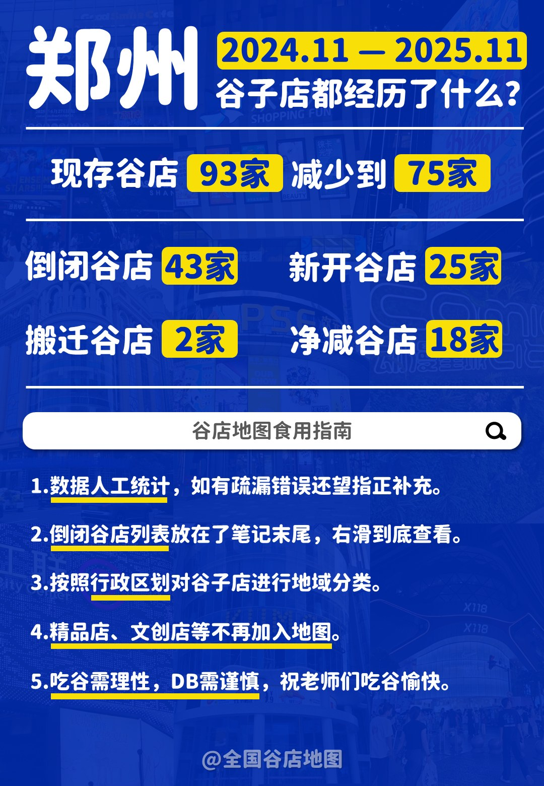
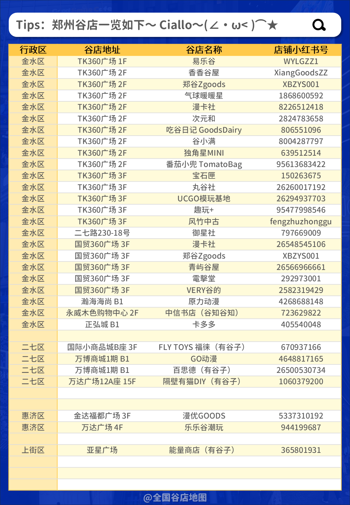
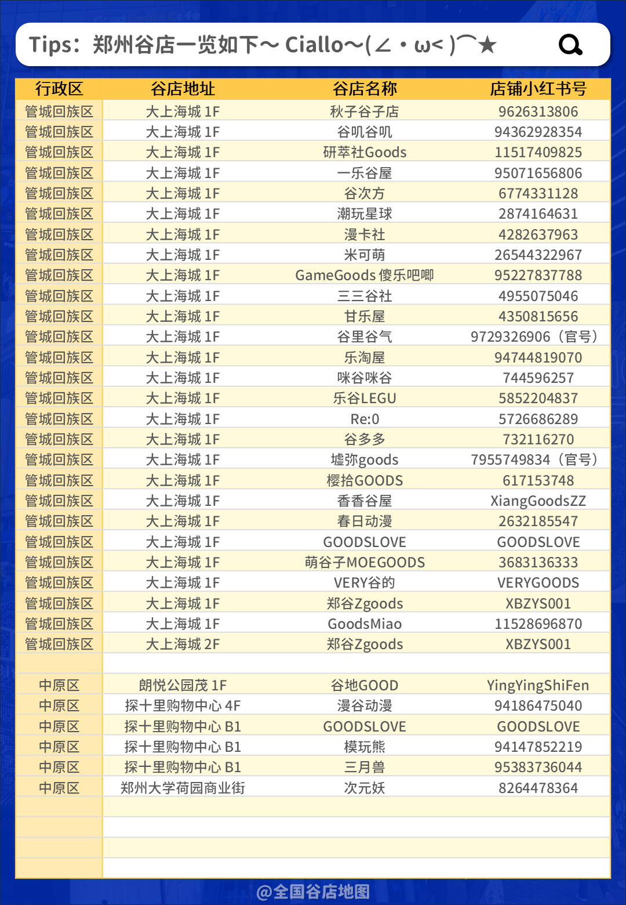
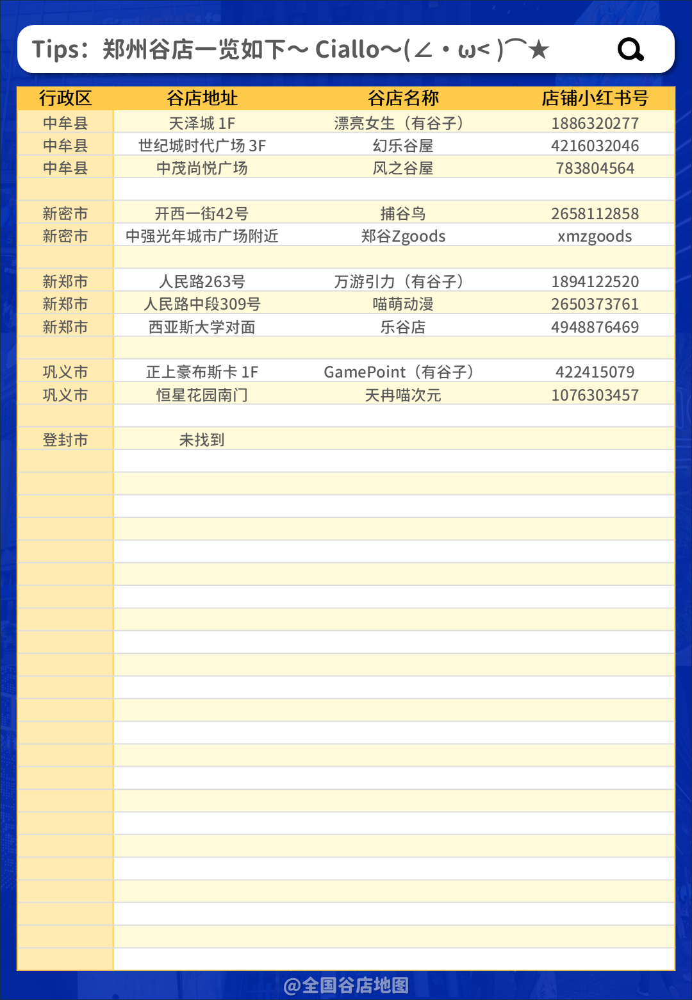
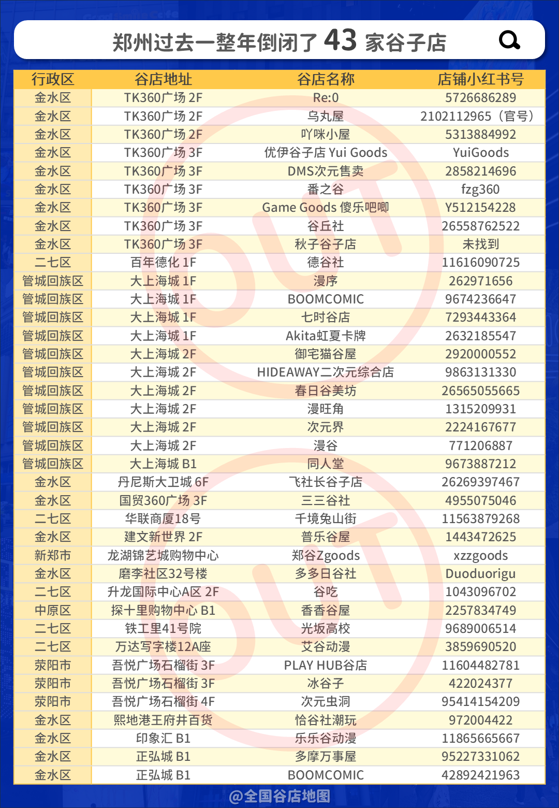
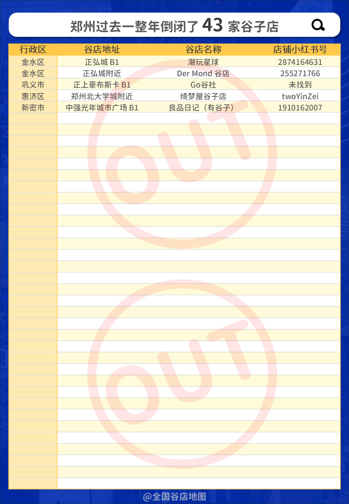

> **版权与授权声明**
>
> 本文内容（含图文数据）系原作者 @全国谷店地图 专项授权大上海萌资讯使用。
>
> **禁止任何第三方以复制、转载、截图、链接、下载、传播等任何形式 使用 本文全部或部分内容。**
>
> 本文不适用 Creative Commons 等开放许可协议，未获本站或@全国谷店地图 书面授权，请勿擅用。
>
> 原文作者：@全国谷店地图
>
> 原文链接：[前往](http://xhslink.com/o/1MCRKlPRTgJ "2.0版！郑州75家二次元谷子店汇总指南攻略")
---

> 精品店、文创店等不再加入地图。
>
> 人工统计，如有疏漏欢迎指正补充。
>
> 吃谷需理性，DB需谨慎，祝老师们吃谷愉快。

---

## 📌 整体趋势并不良好，郑州谷子店一年净减18家

过去一年（2024.11 – 2025.11），郑州谷子店经历了明显的洗牌：

| 指标 | 数量 |
|------|------|
| 年初现存 | 93 家 |
| 年末现存 | 75 家 |
| **倒闭** | **43 家** |
| 新开 | 25 家 |
| 搬迁 | 2 家 |
| **净减** | **18 家** |

> 虽然总店数下降，但**大上海城**和**新田360（TK360）** 等核心商圈依然是吃谷圣地，聚集效应反而更强。

---

## 🏢 大上海城仍为郑州谷店密度TOP1

### ✅ 大上海城 **现存** 谷店（根据2025.11数据）

#### 1F（一楼）
| 谷店名称 | 小红书号 |
|----------|----------|
| 秋子谷子店 | 9626313806 |
| 谷叽谷叽 | 94362928354 |
| 研萃社Goods | 11517409825 |
| 一乐谷屋 | 95071656806 |
| 谷次方 | 6774331128 |
| 潮玩星球 | 2874164631 |
| 漫卡社 | 4282637963 |
| 米可萌 | 26544322967 |
| GameGoods傻乐吧唧 | 95227837788 |
| 三三谷社 | 4955075046 |
| 甘乐屋 | 4350815656 |
| 谷里谷气 | 9729326906（官号） |
| 乐淘屋 | 94744819070 |
| 咪谷咪谷 | 744596257 |
| 乐谷LEGU | 5852204837 |
| Re:0 | 5726686289 |
| 谷多多 | 732116270 |
| 墟弥goods | 7955749834（官号） |
| 樱拾GOODS | 617153748 |
| 香香谷屋 | XiangGoodsZZ |
| 春日动漫 | 2632185547 |
| GOODSLOVE | GOODSLOVE |
| 萌谷子MOEGOODS | 3683136333 |
| VERY谷的 | VERYGOODS |
| 郑谷ZgoodS | XBZYS001 |
| GoodsMiao | 11528696870 |

#### 2F（二楼）
| 谷店名称 | 小红书号 |
|----------|----------|
| 郑谷ZgoodS | XBZYS001 |

---

## 🛍️ 周边商场谷子店分布（重点商圈）

大上海城周边还有多个二次元消费热点，适合一站式扫街。

### 1️⃣ 新田360广场（TK360）—— 金水区

| 楼层 | 店名 | 小红书号 |
|------|------|----------|
| 1F | 易乐谷 | WYLGZZ1 |
| 2F | 香香谷屋 | XiangGoodsZZ |
| 2F | 郑谷Zgoods | XBZYS001 |
| 2F | 气球暖暖星 | 1868600592 |
| 2F | 漫卡社 | 8226512418 |
| 2F | 次元和 | 2824783658 |
| 2F | 吃谷日记GoodsDairy | 806551096 |
| 2F | 谷小满 | 8004287797 |
| 2F | 独角星MINI | 639512514 |
| 2F | 番茄小兜TomatoBag | 95613683422 |
| 3F | 宝石匣 | 150263675 |
| 3F | 丸谷社 | 26260017192 |
| 3F | UCGO模玩基地 | 26294937703 |
| 3F | 趣玩+ | 95477998546 |
| 3F | 风竹中古 | fengzhuzhonggu |

> TK360 的谷店集中在2-3楼，是除大上海城外密度最高的商场。

### 2️⃣ 正弘城（金水区）

| 楼层 | 店名 | 小红书号 |
|------|------|----------|
| B1 | 卡多多 | 405540048 |
| B1 | 潮玩星球 | 2874164631 |

> 正弘城谷店数量虽少，但“潮玩星球”常有限定活动。

### 3️⃣ 国贸360广场（金水区）

| 楼层 | 店名 | 小红书号 |
|------|------|----------|
| 3F | 漫卡社 | 26548545106 |
| 3F | 郑谷Zgoods | XBZYS001 |
| 3F | 青屿谷屋 | 26566966661 |
| 3F | 電擎堂 | 292973001 |
| 3F | VERY谷的 | 2582319429 |

> 国贸360的谷店与TK360形成互补，建议两处连逛。

### 4️⃣ 探十里购物中心（中原区）

| 楼层 | 店名 | 小红书号 |
|------|------|----------|
| 4F | 漫谷动漫 | 94186475040 |
| B1 | GOODSLOVE | GOODSLOVE |
| B1 | 模玩熊 | 94147852219 |
| B1 | 三月兽 | 95383736044 |

> “三月兽”“模玩熊”为较大品牌店，货品较全。

### 5️⃣ 其他值得关注的单店

| 行政区 | 地址/商场 | 店名 | 小红书号 |
|--------|----------|------|----------|
| 金水区 | 瀚海海尚B1 | 原力动漫 | 4268688148 |
| 金水区 | 永威木色2F | 中信书店（谷知谷知） | 723629822 |
| 二七区 | 国际小商品城B座3F | FLYTOYS福徕 | 670937166 |
| 二七区 | 万博商城1期B1 | GO动漫 | 4648817165 |
| 惠济区 | 金达福都广场3F | 漫优GOODS | 5337310192 |
| 中牟县 | 天泽城1F | 漂亮女生 | 1886320277 |
| 新郑市 | 人民路263号 | 万游引力 | 1894122520 |

---

## 📷 原始数据图片（@全国谷店地图）

以下为统计原始图片，点击可查看大图：

  
  
  
  
  
  

---

## 💡 吃谷小贴士

- **大上海城**：建议从1楼逛起，大部分谷店集中在1楼中庭及周边走廊。
- **新田360（TK360）**：与大卫城、大上海城步行距离约10-15分钟，适合串联成“一天扫街路线”。
- **理性消费**：谷子虽好，请勿上头。注意辨别骗子，群内广告仔细甄别。

---

**大上海萌资讯，陪你吃谷不迷路。** 💚

*本页最后更新于 2026年5月2日 · 数据截止2025年11月*

---

> **版权与授权声明**
>
> 本文内容（含图文数据）系原作者 @全国谷店地图 专项授权大上海萌资讯使用。
>
> **禁止任何第三方以复制、转载、截图、链接、下载、传播等任何形式 使用 本文全部或部分内容。**
>
> 本文不适用 Creative Commons 等开放许可协议，未获本站或@全国谷店地图 书面授权，请勿擅用。
>
> 原文作者：@全国谷店地图
>
> 原文链接：[前往](http://xhslink.com/o/1MCRKlPRTgJ "2.0版！郑州75家二次元谷子店汇总指南攻略")